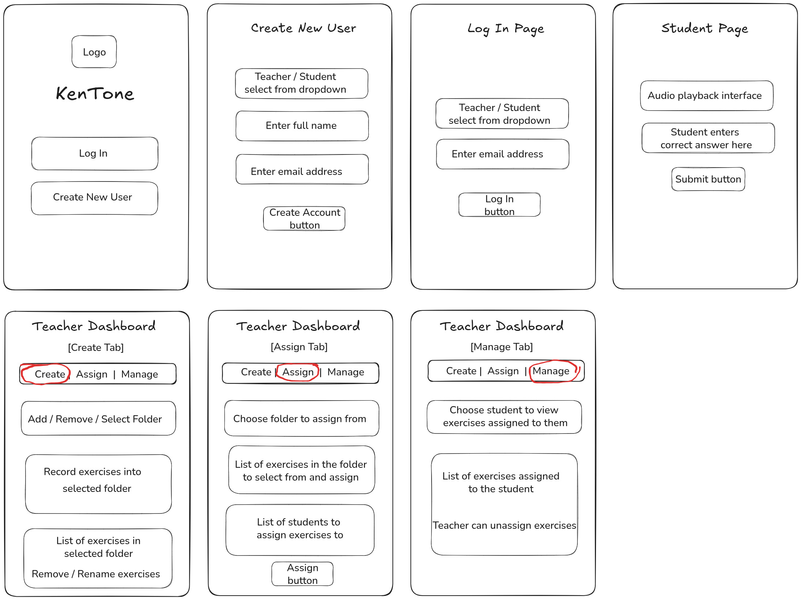

# KenTone - Interactive Ear Training Platform

## Overview

KenTone is an interactive ear training and music education platform that bridges traditional music theory instruction with modern learning technology. Teachers can remotely create, record, and assign personalized listening exercises while students develop aural skills through an engaging, gamified environment accessible from anywhere.



## Features

### For Teachers
- **Exercise Creation**: Record and upload custom audio exercises
- **Bulk Assignment**: Assign multiple exercises to individual or multiple students
- **Content Organization**: Manage exercises with folders for better structure
- **Student Overview**: View enrolled students and track/manage assigned work

### For Students
- **Interactive Exercises**: Real-time validation with visual feedback
- **Progressive Support**: Contextual hints and supportive messages based on attempts
- **Celebration System**: Confetti animations for correct answers
- **Gamified Learning**: Encouraging feedback and progress-based motivation
- **Cross-Platform Access**: Install on mobile or desktop for quick access

## Technology Stack

### Frontend
- **React 19** with modern hooks and functional components
- **Vite** for fast development and optimized builds
- **TailwindCSS** for responsive, accessible styling
- **React Router** for navigation
- **Canvas Confetti** for celebration animations
- **Zustand** for lightweight state management

### Backend
- **Node.js + Express** API server
- **MongoDB + Mongoose** for data persistence
- **JWT authentication** with environment-aware rate limiting (100-3000 req/15min)
- **Data sanitization** and strict CORS policies
- **File Upload Support** for audio exercise recordings

### Infrastructure
- **Frontend Hosting**: Vercel
- **Backend Hosting**: Render
- **Database**: MongoDB Atlas
- **File Storage**: Cloudinary for audio uploads
- **Analytics**: Google Analytics for usage monitoring
- **PWA Support**: Progressive Web App with basic offline caching

## Getting Started

### Prerequisites
- Node.js (version 18 or higher)
- MongoDB (local installation or MongoDB Atlas)
- Git
- Modern web browser

### Local Development Setup

#### 1. Clone the Repository
```bash
git clone https://github.com/tomoarmand/grad-project.git
cd grad-project
```

#### 2. Frontend Setup
```bash
# Install frontend dependencies
npm install

# Create environment file
cp .env.example .env
```

#### 3. Backend Setup
```bash
# Navigate to backend directory
cd grad-api

# Install backend dependencies
npm install

# Create environment file
cp .env.example .env
```

#### 4. Environment Configuration

**Frontend (.env):**
```env
VITE_API_URL=http://localhost:3000
```

**Backend (grad-api/.env):**
```env
MONGODB_URI=your_mongo_uri
JWT_SECRET=your_super_secure_jwt_secret_here
JWT_EXPIRES_IN=7d
API_SECRET=fallback_for_jwt_secret
CLOUDINARY_API_KEY=your_cloudinary_key_here
NODE_ENV=development
PORT=3000
TEACHER_PIN=your_access_code
FRONTEND_URL=http://localhost:5173
```

#### 5. Running the Application

**Start Backend Server:**
```bash
cd grad-api
npm start
# Server runs on http://localhost:3000
```

**Start Frontend Development Server:**
```bash
# From project root in new terminal
npm run dev
# Frontend runs on http://localhost:5173
```

#### 6. Access the Application
- Open http://localhost:5173 in your browser
- Create a teacher or student account
- **Note**: Local testing is limited to account creation and interface exploration. Exercise creation requires Cloudinary API access, and new accounts start empty. Use the [live demo](https://kentone.vercel.app) for full functionality with sample data.

## Available Scripts

### Frontend
```bash
npm run dev          # Start development server
npm run build        # Build for production
npm run preview      # Preview production build
npm run lint         # Run ESLint
```

### Backend (in grad-api/)
```bash
npm start            # Start production server
npm run dev          # Start development with nodemon
```

## Project Structure
```
kentone/
├── src/                 # Frontend React application
│   ├── components/      # Reusable React components
│   ├── store/          # Zustand state management
│   ├── assets/         # Static assets
│   └── main.jsx        # Application entry point
├── grad-api/           # Backend Node.js/Express server
│   ├── routes/         # API route handlers
│   ├── models/         # MongoDB data models
│   ├── middleware/     # Custom middleware
│   └── index.js        # Server entry point
├── public/             # Static files and PWA assets
├── dist/               # Production build output (generated)
└── package.json        # Project dependencies and scripts
```

## Deployment

### Production Build
```bash
npm run build
# Production files generated in dist/ folder
```

### Live Demo
- **Application**: https://kentone.vercel.app